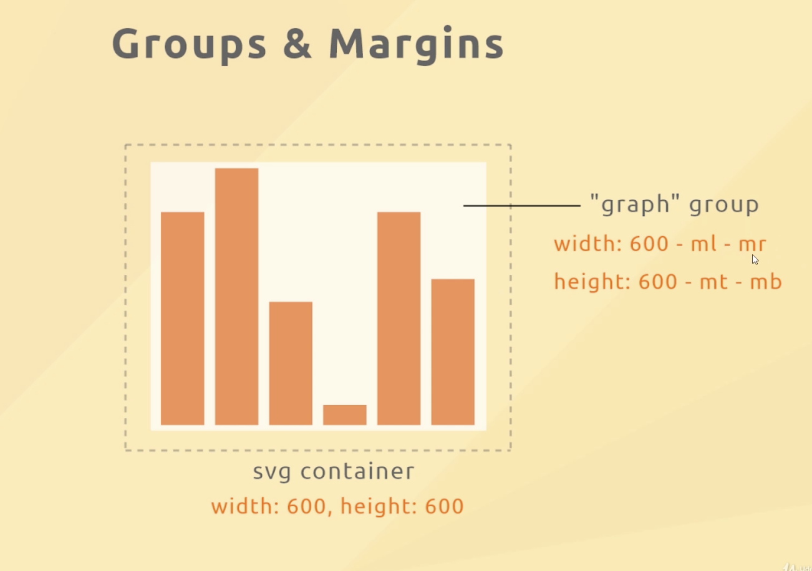

# Groups and Margins

- group the graph

## AXES  

## inverting the bars

## tick formatting

changing the amount of ticks

## D3 UPDATE PATTERN
### Enter and Exit Groups

Data update with Firestore