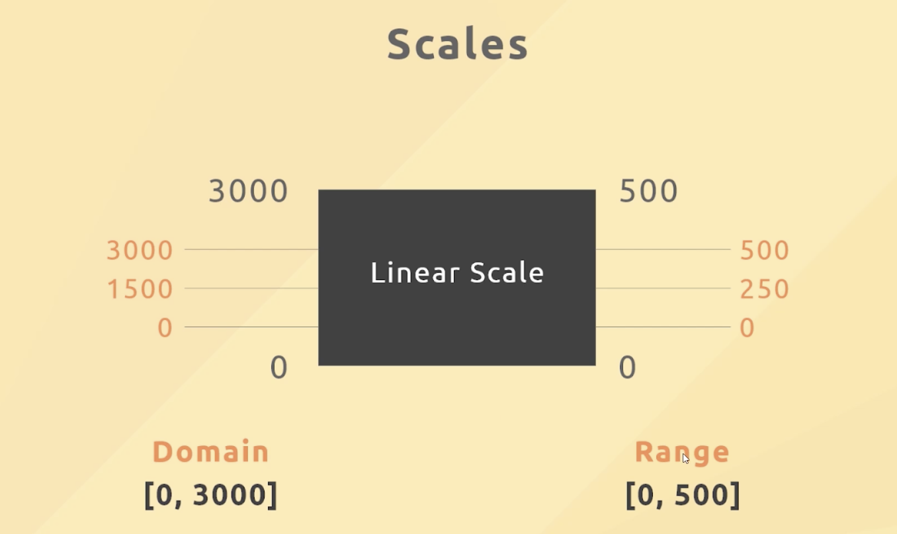
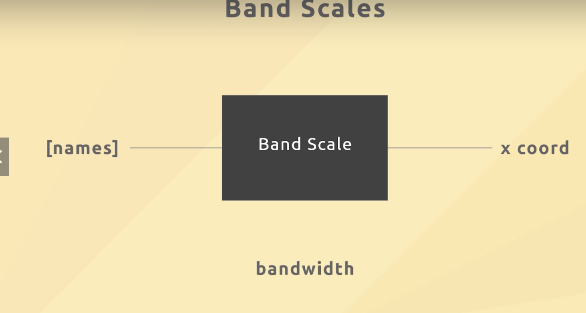

# Linear Scales

- see all the values by scaling down the values



- domain is the input values
- control the **height** by scaling down

## Band Scales

- space out the different categories
- control the **width** and scale down if necessary
  



## MIN, MAX, EXTENT

```javascript
const min = d3.min(data, (d) => d.orders);
const max = d3.max(data, (d) => d.orders);
const extent = d3.extent(data, (d) => d.orders); // extent find both min and max
  console.log(extent);
```

